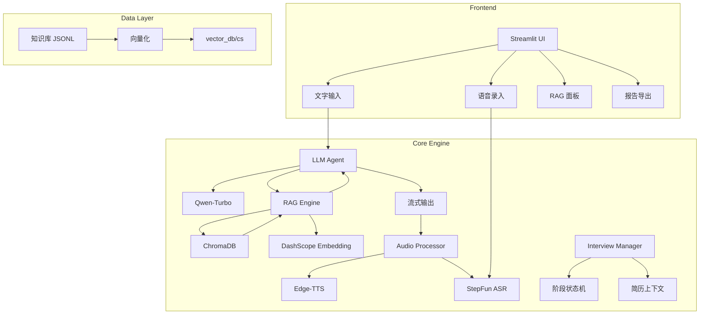

# 🎯 AI 面试官 - 智能技术面试陪练系统

<p align="center">
  
  
  
  
  
</p>

> **一款面向技术求职者的 AI 面试陪练系统**，通过大语言模型模拟真实 FAANG 级别面试官，提供全流程、多维度、沉浸式的面试训练体验。

---

## 📋 目录

- [项目背景与痛点分析](#-项目背景与痛点分析)
- [核心功能与技术亮点](#-核心功能与技术亮点)
- [系统架构](#-系统架构)
- [技术栈详解](#-技术栈详解)
- [个性化与定制能力](#-个性化与定制能力)
- [快速开始](#-快速开始)
- [项目结构](#-项目结构)
- [未来规划](#-未来规划)

---

## 🎯 项目背景与痛点分析

### 技术面试的现实困境

在竞争激烈的技术求职市场中，候选人面临以下核心痛点：

| 痛点 | 现状 | 影响 |
|------|------|------|
| **缺乏模拟环境** | Mock 面试资源稀缺、费用高昂 | 难以积累实战经验 |
| **反馈不及时** | 真实面试后难以获得详细反馈 | 无法针对性改进 |
| **覆盖面有限** | 单一导师难以覆盖全技术栈 | 知识盲区暴露不充分 |
| **时间不灵活** | 需配合他人时间安排 | 训练频次受限 |
| **压力模拟不足** | 难以复现面试高压场景 | 临场发挥不稳定 |

### 解决方案价值主张

本系统通过 **AI + RAG + 语音交互** 技术组合，实现：

- ✅ **7×24 小时**随时可用的面试陪练
- ✅ **FAANG 级别**面试官角色扮演
- ✅ **实时语音交互**，还原真实面试场景
- ✅ **专业知识库**支撑，问题深度有保障
- ✅ **AI 评估报告**，多维度量化反馈
- ✅ **全流程覆盖**：自我介绍 → 项目深挖 → 技术考察 → 代码实战 → 反问环节

---

## 🚀 核心功能与技术亮点

### 1️⃣ 多角色面试官引擎

系统内置 **5 种专业面试官角色**，每种角色具有独特的面试风格和考察重点：

```
┌─────────────────────────────────────────────────────────────┐
│  技术面试官（默认）  │  完整 8 阶段面试流程               │
│  算法面试官         │  LeetCode Medium/Hard 级别代码题    │
│  系统设计面试官     │  分布式架构、高可用方案设计         │
│  行为面试官（BQ）   │  STAR 法则深度追问                  │
│  计算机基础面试官   │  OS/网络/数据库底层原理             │
└─────────────────────────────────────────────────────────────┘
```

**技术实现亮点**：
- 基于 **System Prompt Engineering** 实现角色人设深度定制
- 支持 **自定义 Prompt**，用户可微调面试官行为
- **阶段状态机**自动追踪面试进度（`/next[(n)]` 指令解析）

### 2️⃣ RAG 知识增强检索

集成专业 **CS 知识库**，确保面试问题的专业性和深度：

```
┌──────────────────────────────────────────────────────────────┐
│  知识领域          │  题目数量  │  难度分布              │
├──────────────────────────────────────────────────────────────┤
│  后端开发          │  30+       │  Easy/Medium/Hard      │
│  数据库原理        │  25+       │  索引/事务/分库分表    │
│  数据结构          │  20+       │  树/图/堆/高级结构     │
│  计算机网络        │  25+       │  TCP/HTTP/安全协议     │
│  系统设计          │  20+       │  高并发/分布式架构     │
└──────────────────────────────────────────────────────────────┘
```

**技术实现亮点**：
- **DashScope text-embedding-v2** 向量化引擎
- **ChromaDB** 高性能向量数据库，支持元数据过滤
- **LangChain** 文本分块策略（800 tokens，50 overlap）
- **相似度检索**支持 Top-K 动态调整（1-15）

### 3️⃣ 极致低延迟语音交互

实现 **"边生成边播放"** 的流式语音体验：

```
用户语音 → ASR 识别 → LLM 流式生成 → 实时 TTS → 音频流播放
    │           │            │              │           │
    ↓           ↓            ↓              ↓           ↓
  录音组件   StepFun API   Qwen-Turbo   Edge-TTS    HTML5 Audio
              实时转写      流式输出     并行合成     队列播放
```

**技术实现亮点**：

| 优化点 | 技术方案 | 性能提升 |
|--------|----------|----------|
| **句子级流式 TTS** | 正则实时检测句子边界，检测到完整句立即送 TTS | 首句响应 < 2s |
| **并发 TTS 生成** | PriorityQueue + 4 Worker 线程并发 | 吞吐量 4x |
| **API Key 轮询** | 8 Key 轮询 + 智能冷却管理 | 突破限流瓶颈 |
| **有序音频推送** | Counter 标记 + 顺序输出保证 | 播放无乱序 |
| **Edge-TTS 备选** | 免费方案，零 API 成本 | 成本优化 |

### 4️⃣ AI 深度评估报告

基于 **Qwen-max 思考模式** 生成专业面试评估：

```markdown
📋 AI 面试评价报告

一、总体评分：78 / 100

二、各维度详细评价
   ├── 技术能力（24/30）
   ├── 问题解决能力（20/25）
   ├── 沟通表达能力（16/20）
   ├── 学习潜力与思维深度（10/15）
   └── 综合素养（8/10）

三、亮点总结
四、改进建议
五、总体评语
```

**技术实现亮点**：
- **Qwen-max 深度推理模式**（enable_thinking: true）
- **流式报告生成**，实时展示分析过程
- **多维度加权评分**体系（技术 30% + 解决问题 25% + ...）
- 支持 **Markdown/JSON/TXT** 多格式导出

### 5️⃣ 双端架构设计

```
┌─────────────────────────────────────────────────────────────┐
│                     Streamlit Web UI                        │
│  ┌─────────┬─────────┬─────────┬─────────┐                 │
│  │ 语音对话 │ 文字对话 │ RAG 检索 │ 面试报告 │                 │
│  └────┬────┴────┬────┴────┬────┴────┬────┘                 │
└───────┼─────────┼─────────┼─────────┼───────────────────────┘
        │         │         │         │
┌───────▼─────────▼─────────▼─────────▼───────────────────────┐
│                    FastAPI 后端服务                          │
│  ┌──────────────────────────────────────────────┐           │
│  │  WebSocket /ws/chat  (极致低延迟流式协议)     │           │
│  │  POST /api/tts       (单次 TTS)              │           │
│  │  POST /api/asr       (语音识别)              │           │
│  │  GET  /api/voices    (可用声音列表)          │           │
│  └──────────────────────────────────────────────┘           │
└─────────────────────────────────────────────────────────────┘
```

---

## 🏗️ 系统架构



---

## 🛠️ 技术栈详解

### 核心框架

| 组件 | 技术选型 | 选型理由 |
|------|----------|----------|
| **前端框架** | Streamlit 1.28+ | 快速原型、内置组件丰富、Python 原生 |
| **后端框架** | FastAPI | 异步高性能、WebSocket 原生支持、自动文档 |
| **LLM 引擎** | 阿里云 DashScope | 国内低延迟、Qwen 系列模型丰富 |
| **向量数据库** | ChromaDB | 轻量级、本地持久化、元数据过滤 |
| **RAG 框架** | LangChain | 生态完善、Embedding 集成便捷 |

### 语音处理

| 能力 | 技术方案 | 特点 |
|------|----------|------|
| **语音识别（ASR）** | StepFun step-asr | 中文识别准确率高 |
| **语音合成（TTS）** | Edge-TTS / StepFun | 双方案：免费零成本 / 高品质付费 |
| **流式音频播放** | HTML5 Audio + JavaScript | 队列播放、自动衔接 |

### 关键优化技术

```python
# 1. API Key 轮询器 - 突破单 Key 限流
class APIKeyRotator:
    def __init__(self, api_keys, min_interval=1.5, max_concurrent=4):
        # 8 个 Key 轮询，1.5s 冷却，4 并发

# 2. 句子级流式 TTS - 极致低延迟
class SentenceExtractor:
    SENTENCE_ENDINGS = re.compile(r'([。！？.!?])')
    # 实时检测句子边界，检测到立即送 TTS

# 3. 有序 TTS 管理器 - 并行生成，顺序输出
class OrderedTTSManager:
    # PriorityQueue 保证第一句优先
    # Counter 保证输出顺序正确
```

---

## 🎨 个性化与定制能力

### 1. 面试官角色定制

```python
PRESET_PROMPTS = {
    "技术面试官（默认）": """
        # Role: FAANG 级别算法面试官
        # 面试流程: 0-8 阶段完整流程
        # 考察重点: 代码正确性、复杂度分析、边界处理
    """,
    "自定义": ""  # 用户完全自定义
}
```

**支持能力**：
- ✅ 预设模板一键切换
- ✅ 基于模板微调
- ✅ 完全自定义 System Prompt
- ✅ 面试流程阶段可配置

### 2. 知识库领域扩展

```bash
# 新增知识领域只需 3 步：
# 1. 准备 JSONL 数据
data/new_domain/qa_xxx.jsonl

# 2. 构建向量库
python scripts/build_cs_vector_store.py

# 3. 前端自动识别新领域
# vector_db/ 下的目录自动扫描
```

**支持的元数据过滤**：
- `topic`: 主题分类（backend/database/network/...）
- `difficulty`: 难度等级（easy/medium/hard）

### 3. TTS 声音定制

```python
EDGE_TTS_VOICES = {
    "zh-CN-YunjianNeural": "云健（男声，沉稳磁性，推荐）",
    "zh-CN-YunxiNeural": "云希（男声，年轻活泼）",
    "zh-CN-YunyangNeural": "云扬（男声，新闻播报风格）",
    "zh-CN-XiaoxiaoNeural": "晓晓（女声，甜美活泼）",
    # ... 更多声音
}
```

### 4. 评估维度定制

```python
# 评分权重可调整
评价维度 = {
    "技术能力": 30%,        # 知识深度与广度
    "问题解决能力": 25%,    # 分析与方案能力
    "沟通表达能力": 20%,    # 清晰度与条理性
    "学习潜力": 15%,        # 举一反三能力
    "综合素养": 10%,        # 态度与抗压
}
```

---

## ⚡ 快速开始

### 环境要求

- Python 3.10+
- 阿里云 DashScope API Key
- StepFun API Key（可选，用于高品质 TTS/ASR）

### 安装步骤

```bash
# 1. 克隆项目
git clone https://github.com/your-repo/ai_interviewer.git
cd ai_interviewer

# 2. 安装依赖
pip install -r requirements.txt

# 3. 配置 API Key（编辑 config.py 或设置环境变量）
export DASHSCOPE_API_KEY="your-api-key"

# 4. 构建知识库
python scripts/build_cs_vector_store.py

# 5. 启动应用
# 方式一：Streamlit 前端
streamlit run app.py

# 方式二：FastAPI 后端
uvicorn api_server:app --host 0.0.0.0 --port 8000
```

### 访问地址

- **Streamlit UI**: http://localhost:8501
- **FastAPI Docs**: http://localhost:8000/docs
- **WebSocket**: ws://localhost:8000/ws/chat

---

## 📁 项目结构

```
ai_interviewer/
├── app.py                      # Streamlit 主应用
├── api_server.py               # FastAPI 后端服务
├── config.py                   # 配置中心（API Key、路径、参数）
├── requirements.txt            # 依赖清单
│
├── modules/                    # 核心模块
│   ├── llm_agent.py           # LLM 对话引擎（流式输出）
│   ├── rag_engine.py          # RAG 检索引擎（ChromaDB）
│   ├── audio_processor.py     # 音频处理（TTS/ASR/流式管理）
│   ├── ai_report.py           # AI 报告生成（Qwen-max 思考模式）
│   └── interview_manager.py   # 面试状态管理器
│
├── components/                 # UI 组件
│   └── streaming_audio.py     # 流式音频播放器
│
├── data/                       # 数据目录
│   └── cs/                    # CS 知识库（JSONL 格式）
│       ├── qa_backend.jsonl
│       ├── qa_database.jsonl
│       ├── qa_datastructure.jsonl
│       ├── qa_network.jsonl
│       └── qa_system_design.jsonl
│
├── vector_db/                  # 向量数据库持久化
│   └── cs/                    # CS 领域向量库
│
├── scripts/                    # 工具脚本
│   ├── build_cs_vector_store.py  # 知识库构建
│   └── test_*.py              # 测试脚本
│
└── output/                     # 输出目录
    ├── reports/               # 面试报告
    └── videos/                # 录制视频（预留）
```

---

## 🔮 未来规划

### 短期目标（v1.5）

- [ ] **简历解析**：上传简历自动提取项目经验，针对性提问
- [ ] **代码沙盒**：集成在线代码编辑器，实时运行与评测
- [ ] **多轮追问**：基于候选人回答自适应深挖

### 中期目标（v2.0）

- [ ] **视频面试模式**：WebRTC 实时视频 + 表情/眼神追踪
- [ ] **多语言支持**：英文面试官角色
- [ ] **企业定制版**：接入企业题库、定制评估标准

### 长期愿景

- [ ] **智能体协作**：多 Agent 协作（技术面+HR 面联动）
- [ ] **学习路径推荐**：基于薄弱点生成个性化学习计划
- [ ] **社区题库共建**：UGC 模式丰富知识库

---

## 📄 许可证

MIT License

---

<p align="center">
  <strong>🌟 如果这个项目对你有帮助，请给一个 Star 支持！</strong>
</p>
